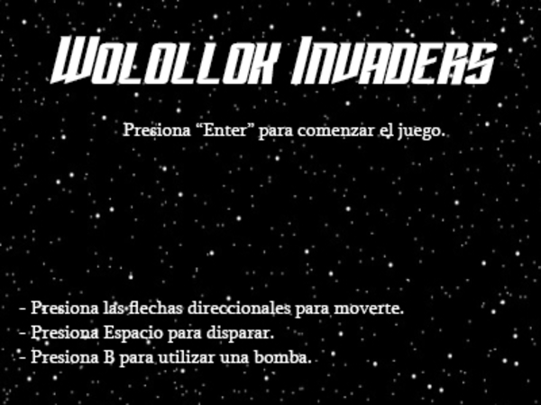

# Wolollok Invaders

## Equipo de desarrollo

- Gomez, Lautaro
- Hidalgo, Franco
- Martini, Giovanni
- Meza, Tomás

## Capturas

## Reglas de Juego / Instrucciones

- Presiona Enter para comenzar el juego.
- Presiona las flechas direccionales para moverte.
- Presiona Espacio para disparar.
- Presiona B para utilizar una bomba.
- Al agarrar un power up (el símbolo de wollok) la nave aumenta de fase, mejorando sus disparos.
- Al usar una bomba, mueren todos los enemigos en pantalla, pero la nave pierde una fase.
- No se puede usar una bomba si la nave está en la primera fase.

## Otros

- Programación con Objetos I - Comisión 1 - Universidad Nacional de Hurlingham
- Versión de wollok
